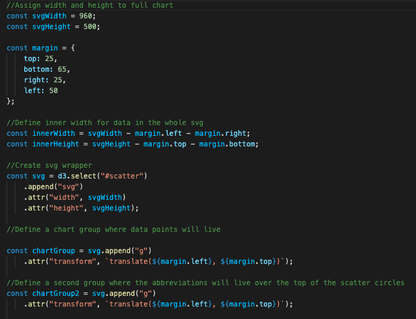
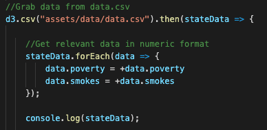
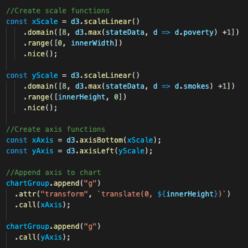
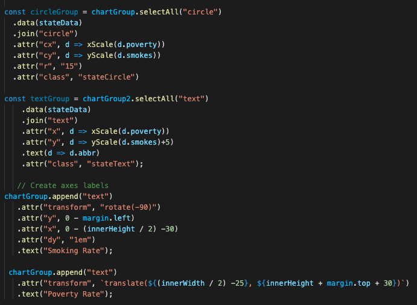
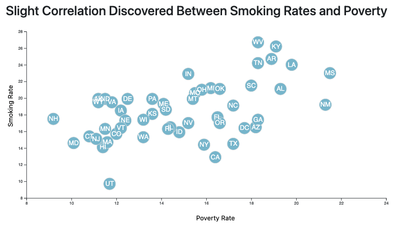

# D3-State-Health-Scatter

### Summary | GRADE: A

For this project, I was given a csv with various health metrics by state. The task was to create a D3.js scatterplot of two different metrics with each point labeled with state abbreviations on the plot. I cxhose to work with poverty and smoking rates.

### Project Writeup

This scatterplot was generated using d3, using svgs correctly placed to demonstrate the correlation between poverty and smoking.

After assigning the height, width and margins for the plot space, the margins were used to create an inner width and height where the chart would be places. Then a g tag was appended within that space where the data would appear. 

Using d3.csv, I loaded in the state health data for poverty and smoking rates, and converted those measurements to numeric format. This I created functions to scale the data appropriately. The exact domain and range were set based on the appearance of the dataset after it was graphed. Using those scale functions, I created axes appended to the right and bottom of the inner svg. 

Once the axes were created, I used d3 to create a circle at the scaled intersection of the x and y axes. I used a similar method to append the state abbreviations in the samle place, giving the appearance of a connection between the circle and the state. Lasty, I appended axis labels in the appropriate spot in chartGroup. 

